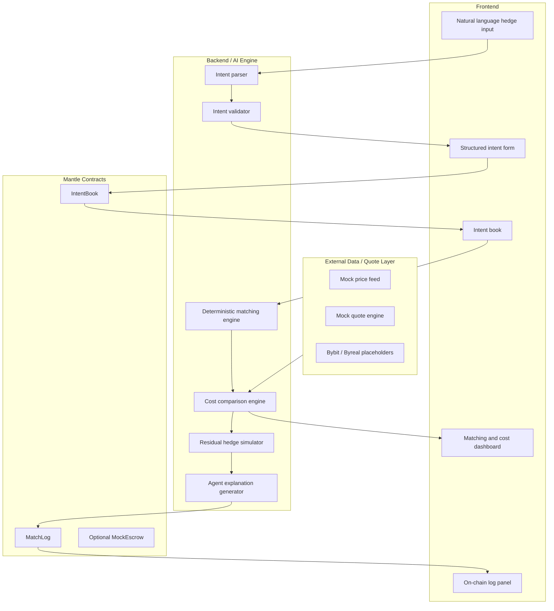

# Architecture

## System Shape

## Important Boundary

AI can parse natural language and explain decisions. It must not own numerical
matching or cost calculations. Matching, residual exposure, cost estimates, and
route gating are deterministic.

## MVP Runtime Strategy

For the hackathon version:

- Keep intent and matching state off-chain for iteration speed.
- Use contracts for transparent event logging and demo tx hashes.
- Use mock quote and price feeds until a Mantle DEX quote is integrated.
- Keep settlement simulation separate from production collateral logic.

## Contract Responsibilities

IntentBook:

- Accept hedge intent submissions.
- Emit `HedgeIntentSubmitted`.
- Allow user cancellation.
- Allow operator matching status updates for MVP.

MatchLog:

- Emit `HedgeMatched`.
- Emit `AgentDecisionLogged`.
- Provide clear event history for the dashboard.

## Core Engine Responsibilities

- Validate supported asset and non-negative numeric fields.
- Exclude expired, cancelled, and fully matched intents.
- Prevent same-wallet matching.
- Match only opposite directions with compatible duration.
- Support partial match allocations.
- Calculate residual exposure.
- Compare naive external execution cost against HedgeMesh cost.
- Generate structured decision inputs for the AI explanation layer.

